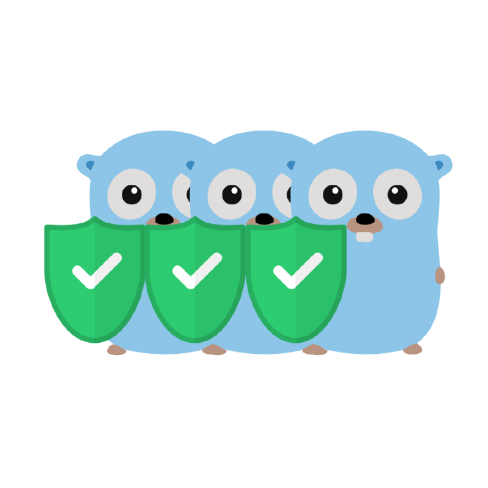

<p align="center"></p>
<p align="center">
<b>A scalable authorization application built on Casbin</b>
</p>

# Casbin-Mesh

<p>
  <a href="https://goreportcard.com/report/github.com/casbin/casbin-mesh">
    
  </a>
  <a href="https://godoc.org/github.com/casbin/casbin-mesh">
    
  </a>
    
</p>

Casbin-Mesh is a lightweight, distributed authorization application. Casbin-Mesh uses [Raft](https://raft.github.io) to gain consensus across all the nodes.

# TOC

- [Install](#install)
- [Quick Start](#quick-start)
- [Documentation](#documentation)
- [License](#license)

# Install

**Notes: Right now, even public images, require [authorization](https://docs.github.com/en/packages/working-with-a-github-packages-registry/working-with-the-container-registry).**  
Include your Token as your password and your GitHub username as your username for Docker

1. Create an access token that you can use from your github account `Settings -> Developer settings -> Personal access tokens`
2. Save your PAT as an environment variable.

```bash
$ export CR_PAT=YOUR_TOKEN
```

3. Using the CLI for your container type, sign in to the Container registry service at `ghcr.io`.

```bash
$ echo $CR_PAT | docker login ghcr.io -u USERNAME --password-stdin
> Login Succeeded
```

## Single Node

### Docker

You can easily start a single Casbin-Mesh node like:

```bash
$ docker pull ghcr.io/casbin/casbin-mesh:latest

$ docker run -it -p 4002:4002 --name=casbin_mesh_single ghcr.io/casbin/casbin-mesh:latest
```

### Binary

```bash
$ casmesh -node-id node0 ~/node1_data
```

## Cluster

- The first benefit of the cluster is that it can be fault-tolerant several nodes crash, which will not affect your business.

- For some special scenarios, you can read from the follower nodes which can increment the throughput of enforcing (reading) operations.

### Docker Compose

docker-compose.yml

```yml
version: "3"
services:
  node0:
    image: ghcr.io/casbin/casbin-mesh:latest
    command: >
      -node-id node0
      -raft-address 0.0.0.0:4002
      -raft-advertise-address node0:4002
      -endpoint-no-verify
    ports:
      - "4002:4002"
    volumes:
      - ./store/casbin/node1:/casmesh/data
  node1:
    image: ghcr.io/casbin/casbin-mesh:latest
    command: >
      -node-id node1
      -raft-address 0.0.0.0:4002
      -raft-advertise-address node1:4002
      -join http://node0:4002
      -endpoint-no-verify
    ports:
      - "4004:4002"
    volumes:
      - ./store/casbin/node2:/casmesh/data
    depends_on:
      - node0
  node2:
    image: ghcr.io/casbin/casbin-mesh:latest
    command: >
      -node-id node2
      -raft-address 0.0.0.0:4002
      -raft-advertise-address node2:4002
      -join http://node0:4002
      -endpoint-no-verify
    ports:
      - "4006:4002"
    volumes:
      - ./store/casbin/node3:/casmesh/data
    depends_on:
      - node0
```

```
$ docker-compose up
```

### Binary

```bash
$ casmesh -node-id -raft-address localhost:4002 -raft-advertise-address localhost:4002 node0 ~/node1_data

$ casmesh -node-id -raft-address localhost:4004 -raft-advertise-address localhost:4004 node1 -join http://localhost:4002  ~/node2_data

$ casmesh -node-id -raft-address localhost:4006 -raft-advertise-address localhost:4006 node2 -join http://localhost:4002  ~/node3_data
```

_Notes: In practice, you should deploy nodes on different machines._

# Quick Start

### Create namespaces

First, We need to create a new namespace, which can be done by performing an HTTP request on the `/create/namespace` on any Casbin-Mesh node.

```bash
$ curl --location --request GET 'http://localhost:4002/create/namespace' \
--header 'Content-Type: application/json' \
--data-raw '{
    "ns": "test"
}'
```

### Set an RBAC model for the test namespace

To setup an Casbin model for a specific namespace, executes following request on `/set/model` endpoint. See all supported [models](https://casbin.org/docs/en/supported-models).

```bash
$ curl --location --request GET 'http://localhost:4002/set/model' \
--header 'Content-Type: application/json' \
--data-raw '{
    "ns":"test",
    "text":"[request_definition]\nr = sub, obj, act\n\n[policy_definition]\np = sub, obj, act\n\n[role_definition]\ng = _, _\n\n[policy_effect]\ne = some(where (p.eft == allow))\n\n[matchers]\nm = g(r.sub, p.sub) && r.obj == p.obj && r.act == p.act"
}'
```

### List all namespaces

Now, let's list the namespaces which we created.

```bash
$ curl --location --request GET 'http://localhost:4002/list/namespaces'
```

The response:

```json
["test"]
```

### Add Polices

Let's add policies for the `test` namespace. See more of [Polcies]()

```bash
$ curl --location --request GET 'http://localhost:4002/add/policies' \
--header 'Content-Type: application/json' \
--data-raw '{
    "ns":"test",
    "sec":"p",
    "ptype":"p",
    "rules":[["alice","data1","read"],["bob","data2","write"]]
}'
```

We will receive the sets of effected rules from the response.

```json
{
  "effected_rules": [
    ["alice", "data1", "read"],
    ["bob", "data2", "write"]
  ]
}
```

### First enforce

Now, Let's figure out whether Alice can read data1.

```bash
$ curl --location --request GET 'http://localhost:4002/enforce' \
--header 'Content-Type: application/json' \
--data-raw '{
    "ns":"test",
    "params":["alice","data1","read"]
}'
```

The answer is yes:

```json
{
  "ok": true
}
```

# Documentation

All documents were located in [docs](/docs) directory.

# License

This project is licensed under the [Apache 2.0 license](/LICENSE).
